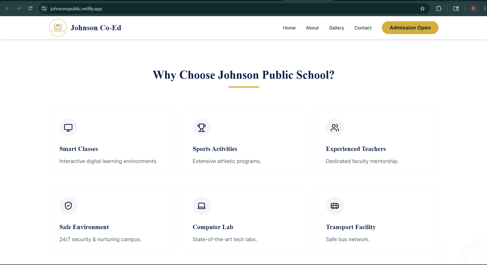
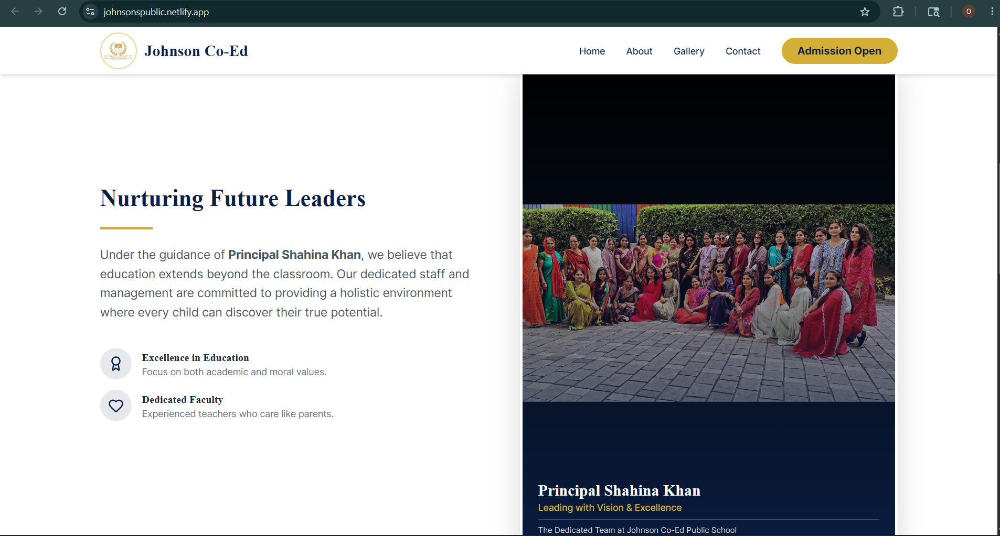

# Johnson Co-Ed Public School Website

A modern and responsive school website developed for a real educational institution, focused on academic branding, admission engagement, faculty showcase, and parent-friendly navigation.

## Features
- Responsive Design
- Admission Section
- Gallery & Activities
- Faculty Showcase
- Modern Academic UI

## Tech Stack
- HTML
- CSS
- JavaScript

## Installation

- npm install
- npm run dev

## Screenshots

### Homepage

---

### Navigation Bar

---

### About Section

## Live Demo
https://johnsonspublic.netlify.app/
